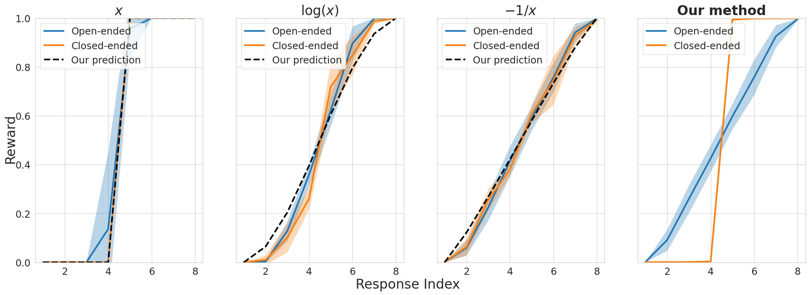

# Reward Collapse in Aligning Large Language Models: A Prompt-Aware Approach to Preference Rankings

*Ziang Song, Tianle Cai, Jason D. Lee, Weijie J Su*

[Paper link](https://arxiv.org/abs/2305.17608)

Codebase is adapted from [OpenAssistant](https://huggingface.co/OpenAssistant/reward-model-deberta-v3-base).

## Abstract
The extraordinary capabilities of large language models (LLMs) such as ChatGPT and GPT-4 are in part unleashed by aligning them with reward models that are trained on human preferences, which are often represented as rankings of responses to prompts. 

In this paper, we document the phenomenon of **reward collapse**, an empirical observation where the prevailing ranking-based approach results in an *identical* reward distribution *regardless* of the prompts during the terminal phase of training. 

This outcome is undesirable as open-ended prompts like “write a short story about your best friend” should yield a continuous range of rewards for their completions, while specific prompts like “what is the capital of New Zealand” should generate either high or low rewards. 

Our theoretical investigation reveals that reward collapse is primarily due to the insufficiency of the ranking-based objective function to incorporate prompt-related information during optimization. This insight allows us to derive closed-form expressions for the reward distribution associated with a set of utility functions in an asymptotic regime. 

To overcome reward collapse, we introduce a prompt-aware optimization scheme that provably admits a prompt-dependent reward distribution within the interpolating regime. Our experimental results suggest that our proposed prompt-aware utility functions significantly alleviate reward collapse during the training of reward models.

## Illustration

Illustration of reward collapse. One type of prompt is open-ended, which should result in a roughly uniform distribution of rewards, while the other is closed-ended, which should yield either high or low rewards (polarized). However, as evidenced in the first three plots, when a common utility function is employed, the two types of prompts result in a strikingly similar reward distribution. Conversely, when a prompt-aware utility is applied, as seen in the fourth plot, the two types of prompts exhibit distinct reward distributions.

## Codebase
- dataset_construction.ipynb: code for constructing the dataset from LongForm dataset.
- ranking_dataset_longform.pt: the constructed dataset.
- trainer.py: code for training the reward model.

## Training Commands:
```bash
python trainer.py configs/x.yml
python trainer.py configs/x_inv.yml
python trainer.py configs/log.yml
python trainer.py configs/x_adaptive.yml
python trainer.py configs/logsigmoid.yml
```

## Citation
```
@article{song2023reward,
  title   = {Reward Collapse in Aligning Large Language Models},
  author  = {Ziang Song and Tianle Cai and Jason D. Lee and Weijie J. Su},
  year    = {2023},
  journal = {arXiv preprint arXiv: 2305.17608}
}
```